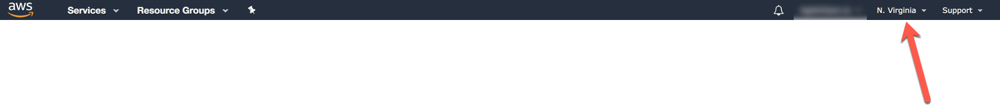
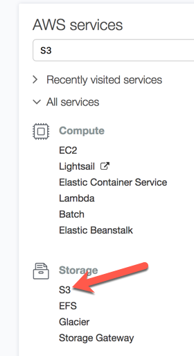
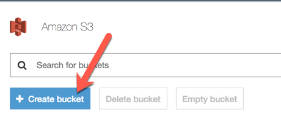

# AWS SAM Jupyter 

AWS SAM project that allows invoking Jupyter notebooks dynamically using the AWS Lambda as the execution environment.

## Test your application locally ###

If running the API for the first time, or **when requirements.txt** file was updated, the following script
should be executed first:

    ./scripts/link.sh
    
It will install and build all dependencies against the Amazon Linux and will place them in the `build/code` 
directory.

Use [SAM Local](https://github.com/awslabs/aws-sam-local) to run your Lambda function locally:

    sam local start-api
    
The API will be running at[http://localhost:3000](http://localhost:3000)

## Deploy ##

### Preparation
To deploy this SAM project, an existing bucket is required in the target region. It can be created using AWS Management Console.

To create an S3 bucket, use the instructions below:

1. Sign-in to the [AWS Management Console](https://console.aws.amazon.com)

2. Ensure a proper region is selected:

3. Open the S3 Console by finding the corresponding icon in the "Storage" section or by typing "S3" in the service search field:

4. Create a new bucket using the "Create bucket" button:

### Deployment
Once the bucket is created, it can be used for the SAM deployment.
Use the "deploy.sh" script and provide all the required parameters:

    ./scripts/deploy.sh <Bucket-Name> <Stack-Name> <Region>

**Bucket Name** parameter should have the same value as the name of the bucket that was created in the previous step.

**Stack Name** can be any alphanumeric value without spaces. Using 
some name for the first time creates a new CloudFormation stack, while
all consequent execution of the scrip with the same name will update
the corresponding CF stack rather than create a new one.

**Region** must match the region of the bucket, created earlier.

## Upload files that can be referenced by the notebook

Selecting one or multiple files will encode those files using Base64 encoding and contents
will be uploaded to the working directory of the Jupyter Notebook.

The total size of all files should not exceed 3 MB in Base64 encoding.

Selecting a single file will also put it's contents to the corresponding text field for further preview.
